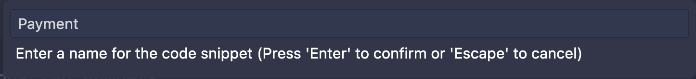

## Component Vault

Introducing Component Vault: A Visual Studio Code extension that simplifies code management. Save, insert, update, and delete code snippets effortlessly. Streamline your workflow, boost productivity, and enhance collaboration.

## Usage

See Component Vault in action with these simple steps:

1. **Saving Code Snippets:**
   
   
2. **Inserting Code Snippets:**
   
3. **Updating Code Snippets:**
   
4. **Deleting Code Snippets:**
   

## How to Use

- Right-click on the code to either insert or save snippets or use Ctrl + Shift + P (Win/Linux) / Cmd + Shift + P (Mac).
- Search 'Code Vault' and select 'Save Selected Code'.
- Select the feature of your choice

## Features

- **Saving Code Snippets:** Save selected code as snippets for future use.
- **Inserting Code Snippets:** Easily insert saved code snippets into your files.
- **Updating and Deleting Code Snippets:** Modify or remove saved snippets as needed.

## Contribution

Feel free to contribute or report any bug.
