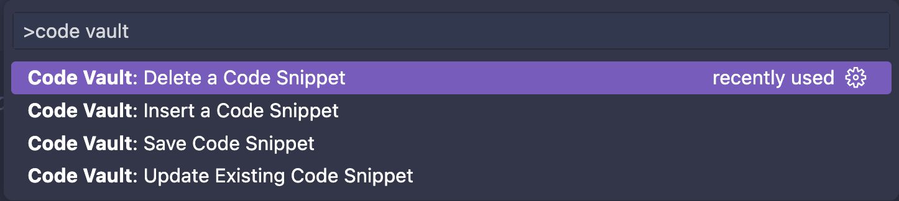

## Component Vault

Introducing Component Vault: A Visual Studio Code extension that simplifies code management. Save, insert, update, and delete code snippets effortlessly. Streamline your workflow, boost productivity, and enhance collaboration.

## How to Use

- Right-click on the code or use Ctrl + Shift + P (Win/Linux) / Cmd + Shift + P (Mac).
- Search 'Code Vault' and select 'Save Selected Code'.
- Select the feature of your choice

## Features

- **Saving Code Snippets:** Save selected code as snippets for future use.
- **Inserting Code Snippets:** Easily insert saved code snippets into your files.
- **Updating and Deleting Code Snippets:** Modify or remove saved snippets as needed.

## For more information

- [Github repository](http://code.visualstudio.com/docs/languages/markdown)

## Contribution

Feel free to contribute or report any bug...
